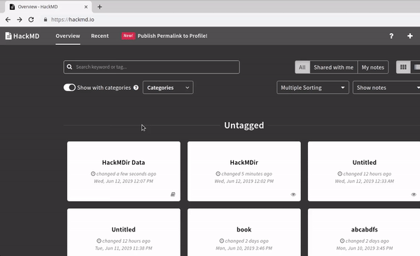
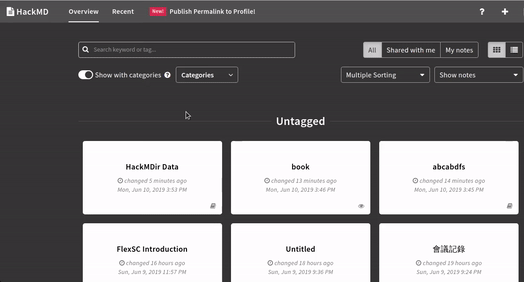
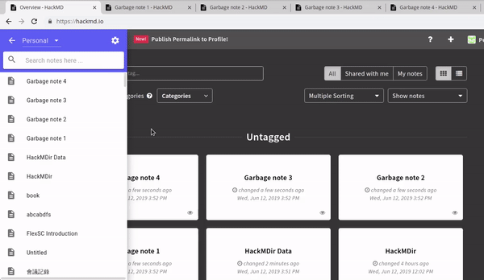
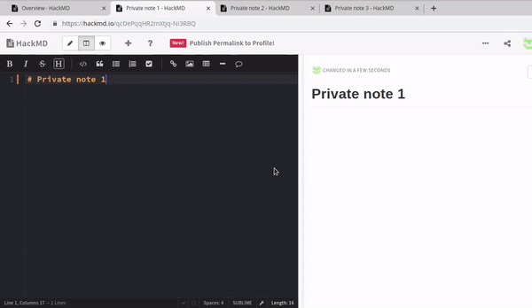
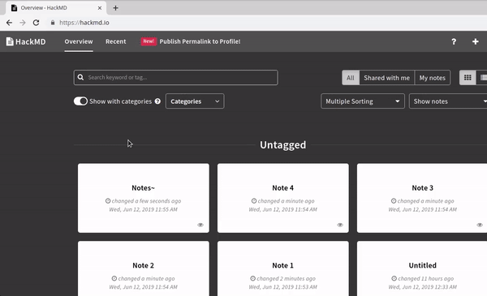

# HackMDir
HackMDir is a Google Chrome Extension that helps HackMD users manage their notes in a better way.

The published version can be found [here](https://chrome.google.com/webstore/detail/hackmdir/mpkcjcncagplbnlkcnplogaiiabhieon) !

## Features
### Groups
Our directory structure helps group relevant notes together faster!


### Drag-and-drop operation
The easy drag-and-drop operation makes better experience when using the extension


### Bulk remove notes/histories or change permissions
There's no need to click into notes and delete them anymore! Our bulk remove function allows users to remove multiple useless notes in a click!



Changing permissions is also accepted.

### Fast export notes as bookmode


## Getting Started
Besides using the [published version](https://chrome.google.com/webstore/detail/hackmdir/mpkcjcncagplbnlkcnplogaiiabhieon) on Chrome Web Store, you can compile your own and make pull requests if you think this project can be better!
### Prerequisites


|          | Version  |
| -------- | -------- | 
|[Node.js](https://nodejs.org/en/) | v10.15.3 |
|[Npm](https://www.npmjs.com/) | v6.4.1 |
|[React](https://reactjs.org/) | v16.8.6 |
|[Redux](https://redux.js.org/) | v7.0.3 |
|[Webpack](https://webpack.js.org/) | v4.32.1 |
|[Babel](https://babeljs.io/) | v7.4.5 |
|[Material-UI](https://material-ui.com/) | v3.9.3 |

### Step one - Install dependencies
`npm install`
### Step two - Build
* `npm run dev` for develpment.
* `npm run build` for production

The code will be generated in `dist/` directory

### Step three - Load extension
Open browser -> go to `chrome://extensions/`
-> Load unpacked -> Choose the `dist/` directory -> Enjoy!


## Directory structure
```
├── src
    ├── api -- backend API
    ├── app 
        ├── components
            ├── list -- Component of notes/dirs	
            └── modals -- Modals of different pages
        ├── containers -- Containers to inject redux state
        └── redux
            ├── actions -- Action declarations
            └── reducers -- Action definitions
                └── index.js  -- combination of all reducers
    ├── content.js -- The injection and initialization of whole HackMDir app
    ├── icons -- Icon of extension
    ├── manifest.json -- Configuration file of extension
    └── style
        └── theme.scss -- Whole app styling file
└── dist -- output directory generated from command "npm run build"
```

## Authors
* author
	* [afcidk](https://github.com/afcidk)
	* [f26401004](https://github.com/f26401004)
	* [yiiju](https://github.com/yiiju)
	* [JamesCamel](https://github.com/JamesCamel)
* UX desighner
	* [Forerunner](https://www.facebook.com/agoarea/)
